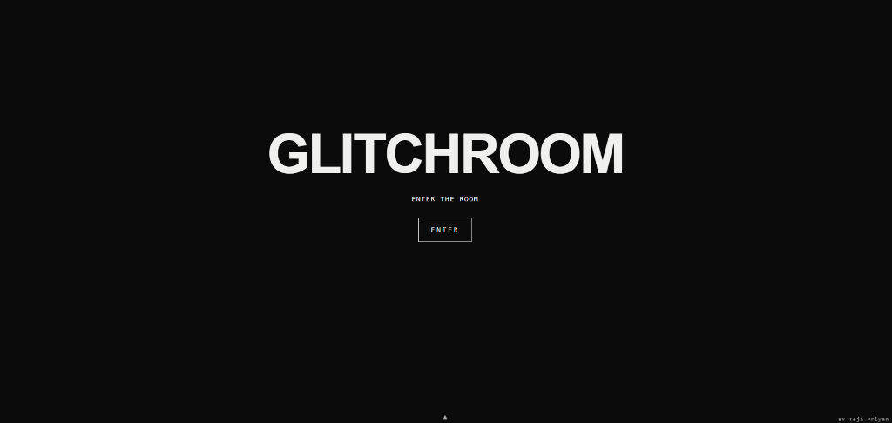

# GLITCHROOM

> **SOMETHING IS WRONG WITH THIS WEBSITE.**

GLITCHROOM is an interactive horror-puzzle web experience in which the website itself is the character. It starts as a calm, minimal page. The more you interact, the more unstable it becomes, until the interface collapses and reveals a hidden series of rooms.

**Created by [Teja Priyan](https://github.com/TejaPriyan)**  
**🎮 Play Live:** [https://glitchroom.vercel.app/](https://glitchroom.vercel.app/)  
*(Mirror: [https://tejapriyan.github.io/GlitchRoom/](https://tejapriyan.github.io/GlitchRoom/))*

---

## ⚡ Overview & Features
- **Escalating Corruption Engine**: Reacts dynamically to mouse speed, clicks, viewport resize, idle time, and scrolling across 6 unstable phases.
- **Procedural Glitch Systems**: Dynamic RGB split, screen tears, melting text, particle physics, and canvas scanlines with photosensitivity rate-limiting.
- **Eight Unique Puzzle Rooms**:
  - **Room 02 (The Windows)**: Spatial window manipulation and escape pathing.
  - **Room 03 (The Observer)**: Dark room spotlight and red entity proximity stealth.
  - **Room 04 (The Patrol)**: Security drone evasion and key collection.
  - **Room 05 (The Choir)**: Tone sequence and glyph memory.
  - **Room 06 (The Reflection)**: Inverted cursor coordinates and decoys.
  - **Room 07 (The Lights)**: 3×3 Lights-out puzzle logic.
  - **Room 08 (The Rewind)**: Timeline alignment scrubber puzzle.
- **Seven Unique Endings**: Explore distinct branches, secrets, and New Game+ mode.
- **Zero Asset Dependencies**: 100% pure code. Procedural audio synthesized in real time via the native Web Audio API (no external sound files).
- **Privacy First**: Progress saved purely locally in your browser (`localStorage`, key `gr`). No external tracking, analytics, or cookies.

---

## 🕹️ Controls
- **Mouse / Touch**: Click, drag, and navigate the interface.
- **ESC**: Close panels, dismiss terminal, or exit to the landing page.
- **Arrow Menu (Bottom Center)**: Open accessibility and game options (Sound toggle, Reduced Motion, High Contrast, Custom Cursor, Performance Modes, Assist Mode, Daily Seed, and Terminal).

---

## 🛡️ Accessibility & Safety
This experience contains flickering, inverted-colour, and displacement effects.
- **Flash Protection**: All rapid flashes are rate-limited to safe thresholds ($\le 3/\text{sec}$).
- **Reduced Motion**: Enabling Reduced Motion in the options menu disables rapid camera movement, viewport shaking, and intense flashing.
- **Assist Mode**: Automatically simplifies puzzle timings and difficulty thresholds.
- **High Contrast**: Toggles stark monochrome mode for maximum legibility.

---

## 📄 License
Released under the [MIT License](LICENSE). Copyright (c) 2026 Teja Priyan.
